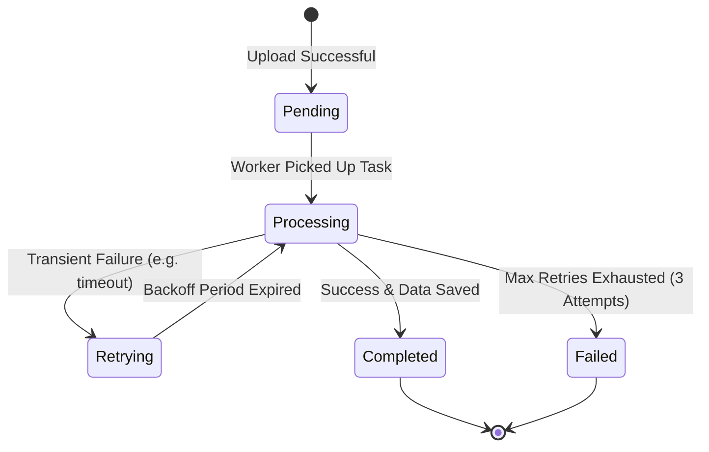

# Processync Error Handling & Retry Strategy

This document outlines the fail-safe mechanisms implemented in the Processync document processing pipeline.

## 1. Resilience Architecture

### Worker Crash Recovery (Acks Late)
We have enabled `task_acks_late = True` in our Celery configuration.
- **Problem**: Default Celery behavior acknowledges a task as soon as it's received. If the worker crashes, the task is lost (it stays "Processing" in the DB but is actually gone).
- **Solution**: The task is only "Acked" after it successfully finishes. If a worker dies mid-task, the Broker (Redis) detects the disconnect and re-assigns the task to another healthy worker automatically.

### Exponential Backoff
We use automatic retries with a backoff strategy.
- **Default**: `retry_backoff=True`.
- **Logic**: If a task fails (e.g., Database timeout), it waits 2s, then 4s, then 8s before trying again. This prevents "hammering" a struggling service and allows for recovery.

## 2. Idempotency (Duplicate Prevention)

To prevent duplicate database records during retries or worker restarts, the processing task implements a **Guard Condition**:

```python
# Before starting heavy work
if job.status == JobStatus.completed:
    return "Already completed"
```

Additionally, the `Result` creation uses an "Upsert" logic (`filter().first() or create()`) to ensure we only ever have one final extraction per job.

## 3. State Transition Lifecycle



## 4. Edge Case Matrix

| Scenario | Handling Mechanism | User Impact |
| :--- | :--- | :--- |
| **Worker Crash** | `acks_late` re-queues task | Minimal latency increase; no data loss. |
| **Database Down** | Exponential Backoff | Job stays in "Processing/Retrying" until DB returns. |
| **Redis Down** | Broker Connection Retry | API/Worker pause until Redis is back. |
| **Invalid File Type** | Early Exception Catching | Job marks as "Failed" immediately. |
| **Manual User Refresh**| Frontend WS Re-attach | UI continues showing progress from any machine. |
